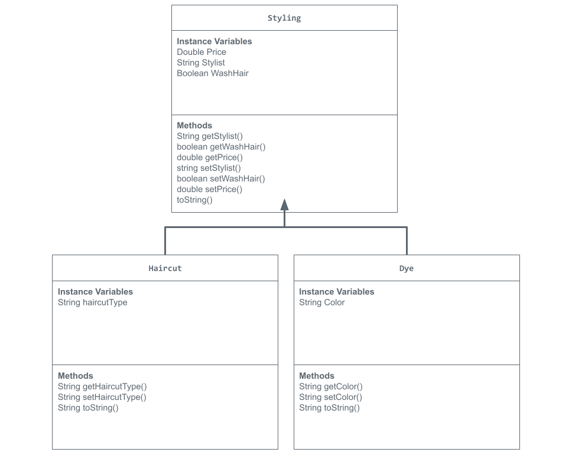

## Unit 2 - Store Management Project

## Introduction

You are opening a new business in your community! Businesses often need programs to manage the products and services they offer and track orders and requests from customers. Your goal is to create a store management system for your business.

## Requirements

Use your knowledge of object-oriented programming and class structure and design to create your store management system:
- **Create a class hierarchy** – Develop a superclass that represents a product or service your business offers and one or more subclasses that extend the superclass to represent more specific types of products or services.
- **Declare instance variables** – Declare instance variables in the superclass that are shared with the subclasses and instance variables in the subclasses that are not shared with the superclass.
- **Write constructors** – Write no-argument and parameterized constructors in the superclass and subclasses. Subclass constructors use the super keyword to call the superclass constructor.
- **Implement accessor and mutator methods** – Write accessor and mutator methods for instance variables that should be accessible and/or modifiable from outside of the class.
- **Implement a toString() method** – Write toString() methods in the superclass and subclasses that return information about the state of an object.

## UML Diagram

## Description
For my store management project I decided to make a Barbershop. I chose this topic because I always admired the work barbers do especially for their clients. So I thought it would be fun to code a barbershop. In order to represent Inheritance in my project I made the Super Class Styling and two Sub Classes Haircut and Dye. For the Styling Super Class I gave it instance variables that every appointment for styling would need. A price, a stylist, and if they washed their hair before or not. To break it down for my subclasses I used the instance variables haircutType for the haircut subclass and color for the dye subclass. I used Accessor and Mutator methods in order to ensure encapsulation of my data between classes. In addition I was able to use toString method in order to organize the representation of my code to print out the instance variable values in the parameterized constructors and no-arguement constructors. 